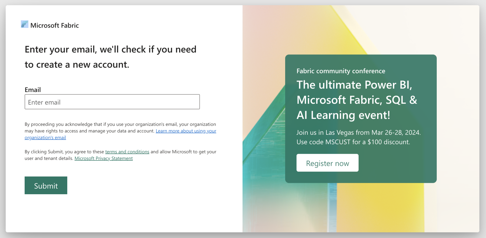
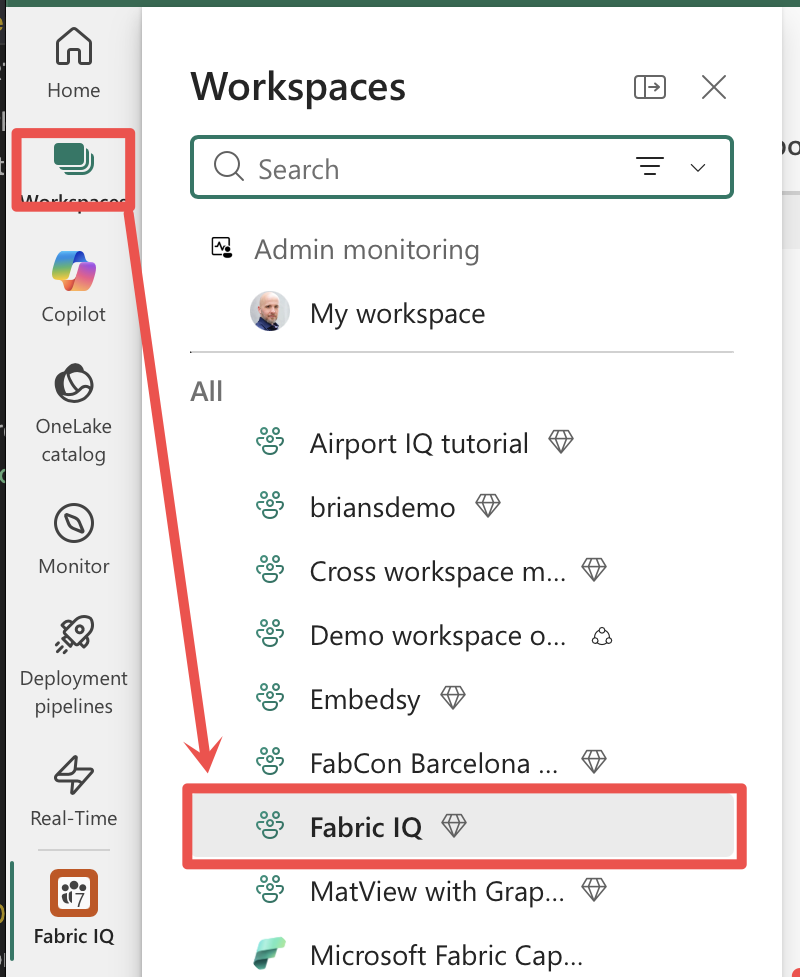
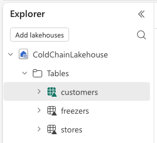
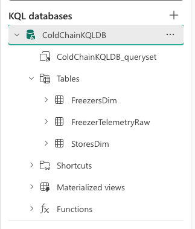

# Lab 08: Set Up and Verify Your Environment

**Duration:** 35 minutes
**Prerequisites:** Microsoft is providing the Fabric tenant/capacity and a dedicated user account for
every attendee at this event — see [`prerequisites/PREREQUISITES.md`](../../prerequisites/PREREQUISITES.md).
The Ontology/Data Agent preview settings, a non-trial capacity, and Contributor access are already set up on that account; there's nothing for you to arrange. Everything you *do* need to do — installing software and provisioning your own workspace — happens right here, live, in Part A below. If you already ran `provision_fabric_iq.py` successfully before today, skip straight to **Part B**.

**Learning objectives**
- Get your own "Fabric IQ" workspace provisioned and ready, live, if you haven't already.
- Confirm the workspace and its five provisioned items exist and are healthy.
- Run the reference-data notebook and confirm the Lakehouse's tables land with real data.
- Confirm the Eventhouse's raw telemetry table exists (even though it's expected to be empty right now).
- Know where to go for help if your own environment isn't in the expected state.

## Before you begin

- [ ] Your laptop has admin rights to install software (Python packages).
- [ ] You have your Microsoft-provided sign-in for this event ready (see
      `prerequisites/PREREQUISITES.md` §2 for how these are distributed) — this is **not** your own
      organization's Fabric account.

## Part A — Set up your environment (skip if you already did this)

1. **Confirm Git and Python 3.10-3.13 are installed.** Pick the block for your OS — both are complete,
   ready-to-paste command sequences:

   **macOS/Linux:**
   ```bash
   git --version
   python3 --version
   ```

   **Windows (PowerShell):**
   ```powershell
   git --version
   python --version
   ```

   > ✅ Expected result: a Git version prints, and `Python 3.10.x` through `3.13.x`. **Python 3.14 is too
   > new** — the Fabric CLI this workshop depends on doesn't support it yet. If either is missing or your
   > Python is outside that range, see [`prerequisites/PREREQUISITES.md`](../../prerequisites/PREREQUISITES.md)
   > §4 for an OS-specific install command, then re-check before continuing.

2. **Clone this repository**, if you don't already have it on this machine:

   ```bash
   git clone https://github.com/brianbonk/FabConIQLabs
   cd FabConIQLabs
   ```

   <details>
   <summary>Troubleshooting</summary>

   If `git clone` hangs or fails, you may be on a restrictive venue network blocking it — see
   [`prerequisites/PREREQUISITES.md`](../../prerequisites/PREREQUISITES.md) §3, or ask a neighbor to
   share the folder directly for now and sort out network access at the next break.
   </details>

3. **Run the environment checker**, then create and activate an isolated virtual environment as it
   instructs:

   **macOS/Linux:**
   ```bash
   python3 setup/check_environment.py
   ```

   **Windows (PowerShell):**
   ```powershell
   python setup/check_environment.py
   ```

   This re-confirms Git and Python, then — since recent Python installs (Homebrew, python.org, most Linux
   distros) refuse `pip install` outside a virtual environment and raise
   `externally-managed-environment` — creates a `.venv` folder for you if one isn't already active. It
   prints the exact activate command for your OS/shell; run it, then re-run the checker with
   `--install-deps` to also install the dependencies:

   **macOS/Linux:**
   ```bash
   source .venv/bin/activate
   python3 setup/check_environment.py --install-deps
   ```

   **Windows (PowerShell):**
   ```powershell
   .venv\Scripts\Activate.ps1
   python setup/check_environment.py --install-deps
   ```

   > ✅ Expected result: ends with `ENVIRONMENT READY`, and `fab --version` now works. This installs
   > `ms-fabric-cli`, `pyyaml`, and `azure-eventhub` (the last one is for Module 10's telemetry generator,
   > not this script).

   <details>
   <summary>Troubleshooting</summary>

   If you see `error: externally-managed-environment` here, your venv likely isn't active — check your
   shell prompt shows `(.venv)`, then retry. See [`setup/README.md`](../../setup/README.md) for the full
   troubleshooting table.
   </details>

4. **Run the provisioning script** (from the same activated-venv terminal, inside `setup/`):

   **macOS/Linux:**
   ```bash
   cd setup
   python3 provision_fabric_iq.py
   ```

   **Windows (PowerShell):**
   ```powershell
   cd setup
   python provision_fabric_iq.py
   ```

   This prompts you to sign in (`fab auth login`) with your **Microsoft-provided account for this
   event** if you aren't already, then lists your eligible Fabric capacities and asks you to pick one —
   there should be exactly one, already assigned to you by Microsoft.

   <details>
   <summary>Troubleshooting — sign-in hangs or fails</summary>

   If the browser/device-code flow doesn't complete, you're likely on a restrictive venue network. Try a
   different network (phone hotspot) if one's available, or pair with a neighbor for now — see
   [`prerequisites/PREREQUISITES.md`](../../prerequisites/PREREQUISITES.md) §3.
   </details>

   <details>
   <summary>Troubleshooting — no non-trial capacity available, or a trial-capacity warning</summary>

   **Stop here — this specific problem cannot be fixed live.** Ontology, Graph, and Data Agent features
   do not work on trial (FT1) capacities, and every module from 11 onward will fail all afternoon if you
   proceed on one anyway. This shouldn't happen — Microsoft is providing a dedicated non-trial capacity
   per attendee — so if you see this, don't spend your Part A time troubleshooting it yourself:
   - **Flag a facilitator immediately.** This means the Microsoft-provided account/capacity isn't set up
     the way it should be; the presenter needs to follow up with Microsoft, not something you did wrong
     or can fix by re-running the script.
   - **Pair with a neighbor** whose capacity is working and follow along on their screen for the rest of
     today while that gets sorted out — see [`docs/risk-fallback-plan.md`](../../docs/risk-fallback-plan.md).
   </details>

5. **Let the script finish.** It creates a "Fabric IQ" workspace and provisions the Lakehouse, Eventhouse,
   KQL database, Eventstream, and Notebook items, then applies the KQL database's schema — all using the
   one sign-in from step 4, no further prompts.

   > ✅ Expected result: a summary block printing `[OK]` for all five items plus the KQL schema step,
   > ending with a deep link into the workspace. This typically takes a few minutes — while it runs, this
   > is a good moment to skim ahead to Module 09.

   <details>
   <summary>Troubleshooting — `[FAILED]` or `MISSING` items in the summary</summary>

   Most errors map directly to a fix in [`setup/README.md`](../../setup/README.md)'s troubleshooting
   table — check there first. It's safe to just re-run `python3 provision_fabric_iq.py` (**Windows:**
   `python provision_fabric_iq.py`; pass `--force` to skip prompts) once you've addressed the underlying
   cause; it won't duplicate anything that already succeeded.
   </details>

## Part B — Verify your environment

Continue from here whether you just finished Part A or arrived with your workspace already provisioned.

6. **Open** [app.fabric.microsoft.com](https://app.fabric.microsoft.com) in your browser and sign in if
   prompted.

   

   > ✅ Expected result: the Fabric portal home page loads, showing your recent items and a workspace list
   > in the left navigation.

7. **Click** **Workspaces** in the left navigation, then **click** the **Fabric IQ** workspace.

   

   <details>
   <summary>Troubleshooting</summary>

   If you don't see a workspace named exactly **Fabric IQ** in the list, Part A either wasn't run,
   didn't finish, or created the workspace under a different account than the one you're signed in with
   now. Go back and re-run `python3 provision_fabric_iq.py` (**Windows:** `python provision_fabric_iq.py`),
   or see the "If your environment isn't ready" section below.
   </details>

   > ✅ Expected result: the workspace opens and shows a list of items.

   *Adapted from: [Get started with Fabric IQ](https://learn.microsoft.com/fabric/iq/get-started-with-fabric-iq)*

8. **Confirm** the item list shows exactly these five items (names are case-sensitive and exact) — plus a
   `ColdChainLakehouse.SQLEndpoint`, which Fabric auto-creates alongside every Lakehouse and isn't
   something the script provisions itself, so don't count it against the five:
   - `ColdChainLakehouse` (Lakehouse)
   - `ColdChainEventhouse` (Eventhouse)
   - `ColdChainKQLDB` (KQL database)
   - `FreezerTelemetryEventstream` (Eventstream)
   - `00_LoadReferenceData` (Notebook)

   

   <details>
   <summary>Troubleshooting</summary>

   Missing one or more items? Re-run `python3 provision_fabric_iq.py` (**Windows:**
   `python provision_fabric_iq.py`) — it's safe to re-run and will only create what's missing, not
   duplicate what already exists. If it still fails, see
   [`setup/README.md`](../../setup/README.md) for mapped error messages, or flag a facilitator.
   </details>

   > ✅ Expected result: all five items are present. You do **not** see an Ontology, Graph, or Data Agent
   > item yet — those don't exist yet on purpose. We build them live starting in Module 11.

9. **Click** **00_LoadReferenceData** in the workspace item list to open the notebook, then **click**
   **Run all** on the ribbon.

   This step is required, not optional — `provision_fabric_iq.py` deliberately only *imports* this
   notebook, it does not run it for you (importing a notebook item never executes it). Until you run it,
   the Lakehouse's **Tables** node in the next step will be empty — there's no in-between "tables exist
   but empty" state, because the notebook is what creates the tables in the first place.

   > ✅ Expected result: all cells run successfully (green checkmarks top to bottom), ending with the
   > printed message `00_LoadReferenceData completed successfully: Stores, Freezers, Customers tables
   > are ready.` This typically takes under a minute.

   <details>
   <summary>Troubleshooting</summary>

   - **Notebook won't open / `00_LoadReferenceData` isn't in the item list:** Part A didn't finish
     successfully. Re-run `python3 provision_fabric_iq.py` (or `.\run-setup.ps1` / `./run-setup.sh`) — it's
     safe to re-run.
   - **A cell errors partway through:** re-run **Run all** once — a cold Spark session occasionally times
     out its first read. If it fails the same way twice, check the error against
     [`setup/README.md`](../../setup/README.md)'s troubleshooting table, or flag a facilitator.
   </details>

10. **Click** **ColdChainLakehouse** to open it, then **expand** the **Tables** node in the left Explorer
    pane if it isn't already expanded.

    

    > ✅ Expected result: three Delta tables are listed — `Customers`, `Stores`, `Freezers`.

11. **Click** each of the three tables in turn and **confirm** each one shows rows of data in the preview
    pane, not an empty table.

    

    <details>
    <summary>Troubleshooting</summary>

    Tables missing or empty? Go back to step 9 and confirm **Run all** actually completed (check for a
    red error badge on any cell, and the "completed successfully" message in the last cell's output), then
    re-check the tables here. If it still fails, see [`setup/README.md`](../../setup/README.md).
    </details>

    > ✅ Expected result: `Customers`, `Stores`, and `Freezers` each contain multiple rows of reference
    > data — this is the static business context Module 10 grounds live telemetry against.

    *Adapted from: [Get started with Fabric IQ](https://learn.microsoft.com/fabric/iq/get-started-with-fabric-iq)*

12. **Go back** to the workspace item list and **click** **ColdChainEventhouse** to open it, then **click**
    the **ColdChainKQLDB** database in the left Explorer pane.

    

    > ✅ Expected result: the KQL database opens with a query editor pane and `FreezerTelemetryRaw` listed
    > as a table under the database.

13. **Type** the following query into the query editor and **click** **Run**:

    ```kql
    FreezerTelemetryRaw
    | take 10
    ```

    

    > ✅ Expected result: the query runs successfully and returns **zero rows**. This is expected, not a
    > bug — the `FreezerTelemetryRaw` table exists and is ready to receive data, but the synthetic freezer
    > telemetry generator hasn't been started yet. That happens in Module 10. If the query errors instead
    > of returning zero rows (for example, "table not found"), that's the actual problem to flag — see
    > Troubleshooting below.

    <details>
    <summary>Troubleshooting</summary>

    - **Query returns 0 rows:** expected — no action needed, continue to the checkpoint below.
    - **"Table 'FreezerTelemetryRaw' could not be resolved":** the Eventhouse/KQL database import may not
      have completed. Re-run `provision_fabric_iq.py`; if the table still doesn't appear, see
      [`setup/README.md`](../../setup/README.md).
    - **Query editor won't open / permissions error:** confirm you're signed in with the same
      Microsoft-provided account the script used. Contributor rights on the workspace should already be
      in place on that account — if they're not, this is a Microsoft-side setup issue, not something to
      self-diagnose; flag a facilitator.
    </details>

    *Adapted from: [Get started with Fabric IQ](https://learn.microsoft.com/fabric/iq/get-started-with-fabric-iq)*

## If your environment isn't ready

If Part A didn't complete, or any of Part B's checks fail and re-running `provision_fabric_iq.py` doesn't
fix it within a couple of minutes, don't burn your whole Module 08 slot troubleshooting solo:

- **Pair with a neighbor** whose environment verified successfully — this is the designated fallback per
  [`docs/risk-fallback-plan.md`](../../docs/risk-fallback-plan.md), and it's completely fine to follow
  along on someone else's screen for the rest of this section while your own gets sorted out at a break.
- Flag a facilitator — an already-provisioned "instructor" workspace is available to screen-share as a
  last resort.
- Full error-message-to-fix mappings live in [`setup/README.md`](../../setup/README.md) and
  [`prerequisites/PREREQUISITES.md`](../../prerequisites/PREREQUISITES.md) if you want to fix it properly
  at the next break instead of pairing up.

> 🎤 Facilitator note: pause here and ask who's seeing something different before moving on — this is now
> a 35-minute agenda slot precisely because most of the room is provisioning live, not just stragglers;
> don't let it silently eat into Module 09's time regardless.

<!-- facilitator: the most common failure here is signing in with a different account than the one the script authenticated with — check that first before assuming the script itself failed. The second most common is a trial capacity slipping through despite the hard-block warning; don't let anyone proceed on one. -->

## Checkpoint

At the end of this lab, your "Fabric IQ" workspace should contain:
- `ColdChainLakehouse` with three populated tables: `Customers`, `Stores`, `Freezers`
- `ColdChainEventhouse` with a `ColdChainKQLDB` database whose full schema is already in place: an empty
  (but queryable) `FreezerTelemetryRaw` table, seeded `StoresDim`/`FreezersDim` dimension tables, and the
  `FreezerTelemetryEnriched` materialized view (also empty until telemetry flows in Module 10) — all
  applied automatically by `provision_fabric_iq.py`'s KQL schema step
- `FreezerTelemetryEventstream`
- `00_LoadReferenceData` notebook

No Ontology, Graph, Data Agent, or Operations Agent items exist yet — that's expected. Continue to
[Module 09: Architecture & Context](../module-09-architecture-and-context/lab-09-explore-workspace-and-data-landscape.md).
