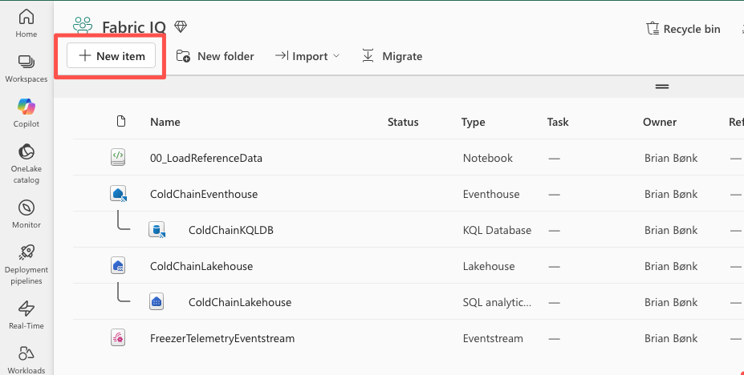
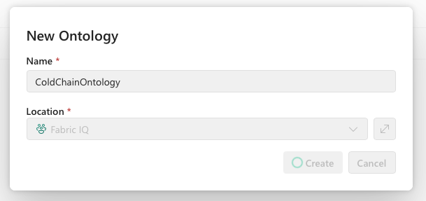
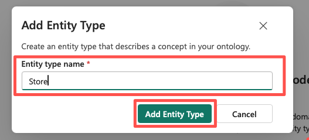
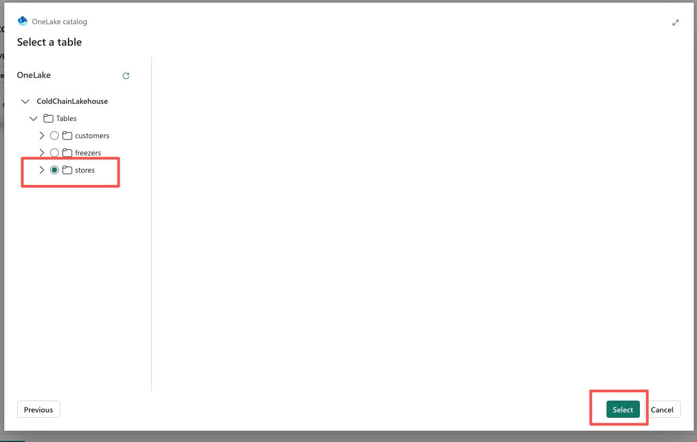
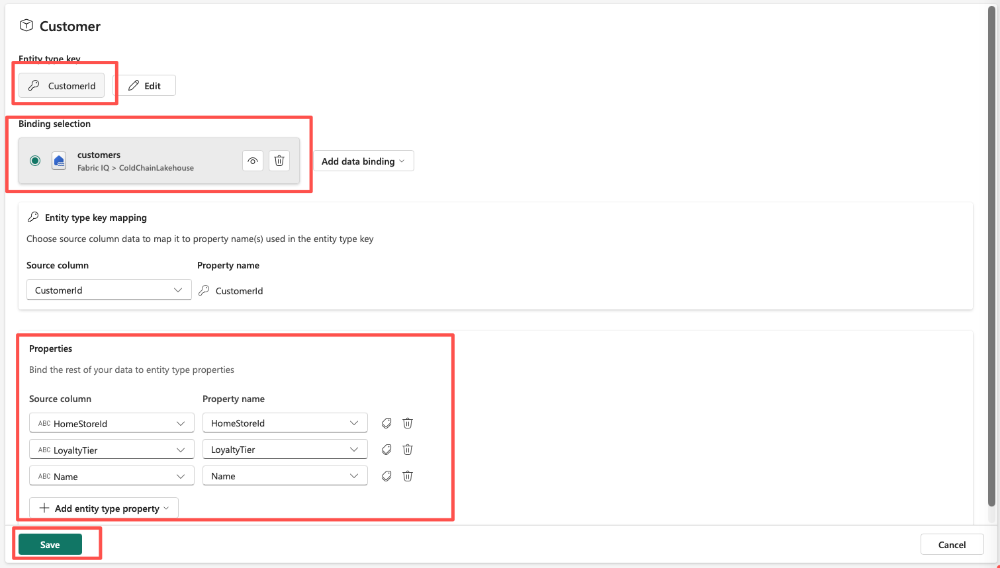
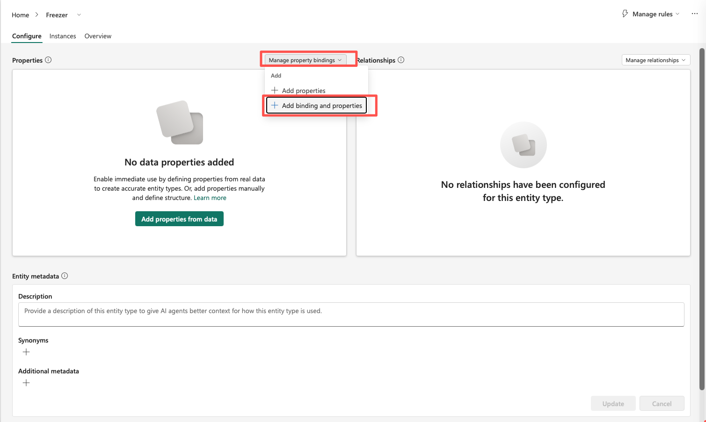
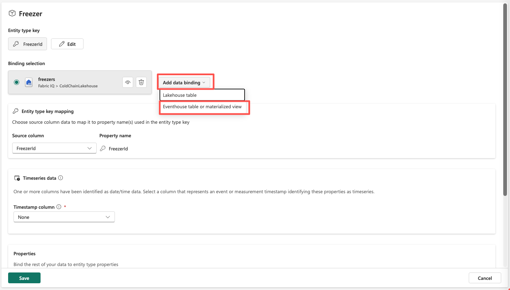
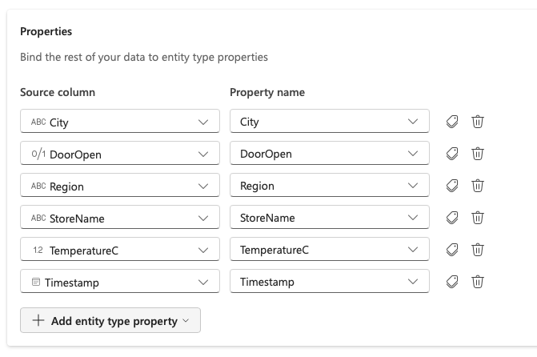
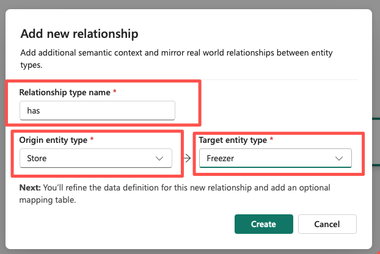
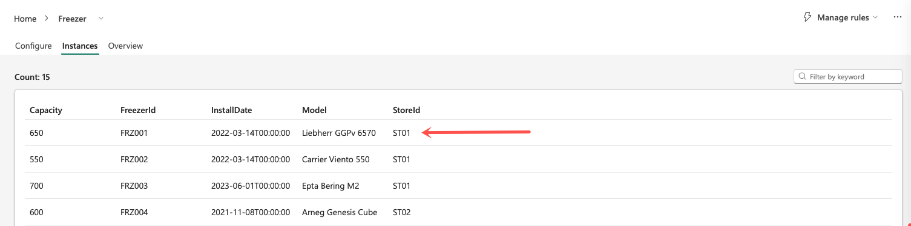

# Lab 11: Build the Retail Cold-Chain Ontology

**Duration:** 30 minutes
**Prerequisites:** Module 10 complete. The "Fabric IQ" workspace contains `ColdChainLakehouse` (with populated `Customers`, `Stores`, `Freezers` tables) and `ColdChainEventhouse` (with a `ColdChainKQLDB` KQL database containing a populated `FreezerTelemetryEnriched` table). The Module 10 freezer telemetry generator is still running.

**Learning objectives**
- Create an **Ontology (preview)** item and build entity types, properties, and relationships entirely through the no-code configuration canvas.
- Bind one entity type (`Freezer`) to two different underlying sources — a Lakehouse table for static attributes and an Eventhouse table for live signals — and understand this as one binding is a reference, not a copy.
- Create relationship types that traverse mismatched key column names (`HomeStoreId` → `StoreId`).
- Open the ontology's graph view, understand what "live" actually means for a preview-graph binding, and refresh it correctly.

## Before you begin

Confirm your environment matches this state before starting:
- [ ] The "Fabric IQ" workspace exists and you have **Contributor** role or higher on it (Viewer access is not sufficient for ontology configuration).
- [ ] `ColdChainLakehouse` contains populated `Customers` (CustomerId, Name, HomeStoreId, LoyaltyTier), `Stores` (StoreId, StoreName, Region, City), and `Freezers` (FreezerId, StoreId, Model, Capacity, InstallDate) tables.
- [ ] `ColdChainEventhouse` → `ColdChainKQLDB` contains a `FreezerTelemetryEnriched` table with rows carrying live `TemperatureC` and `DoorOpen` values per `FreezerId`, from Module 10.
- [ ] The Module 10 freezer telemetry generator script is still running in a terminal somewhere — if you stopped it, restart it now, since Step 20 of this lab depends on fresh events still arriving.
- [ ] Your tenant admin has enabled the **Ontology item (preview)** tenant setting, per [`prerequisites/PREREQUISITES.md`](../../prerequisites/PREREQUISITES.md). **This cannot be fixed during the workshop.**

Troubleshooting: "Ontology (preview)" doesn't appear as an item type

If Step 1 below doesn't show **Ontology (preview)** as a search result under **+ New item**, do not spend time troubleshooting live — this is a tenant-level setting that only a Fabric administrator can change, and changes can take time to propagate even after they're made. Instead:

1. Confirm with your neighbor whether they see it — if it's isolated to your account, it may be a permissions issue (see the Contributor-role checklist item above) rather than a tenant setting issue.
2. If it's affecting the room broadly, flag it to the facilitator immediately. See [`docs/risk-fallback-plan.md`](../../docs/risk-fallback-plan.md) for the pre-recorded walkthrough and static screenshot fallback for this specific module.
3. After the workshop, see [`prerequisites/PREREQUISITES.md`](../../prerequisites/PREREQUISITES.md) section 1 and have your tenant admin enable **Enable Ontology item (preview)** in the admin portal's tenant settings.

## Steps

### Create the ontology item

1. **Open** the **Fabric IQ** workspace. **Click** the **+ New item** button.

   

2. **Type** `Ontology` in the item-type search box, and confirm **Ontology (preview)** appears as a result.

   > ✅ Expected result: an **Ontology (preview)** tile appears in the search results, with a preview flag/badge on it.

   

   
Troubleshooting

   If nothing appears for "Ontology," see the "Ontology (preview) doesn't appear" troubleshooting block under **Before you begin** — this is the tenant-setting failure mode, and it cannot be fixed live.
   

3. **Select** the **Ontology (preview)** tile.

4. **Type** `ColdChainOntology` in the **Name** field and **click** **Create**.

   

   > ✅ Expected result: a blank ontology configuration canvas opens, with an empty **Explorer** pane on the left.

   

   
Troubleshooting

   If you see an error that Fabric is unable to create the ontology item, this is almost always the same tenant-setting gap as Step 2 — re-check with your facilitator rather than retrying repeatedly. Also confirm the name uses only letters, numbers, and underscores (no spaces or dashes) — `ColdChainOntology` already satisfies this.
   

<!-- facilitator: this is the step where a mistyped tenant setting shows up as an error, not a missing menu item — watch for attendees who get *past* step 2 but fail at step 4, since that's a different failure mode (retry) than step 2 (escalate). -->

### Create the Store entity type and bind it to Lakehouse data

5. **Select** **Add entity type** from the top ribbon (or the **+ Add entity type** control in the center of the canvas).

6. **Type** `Store` in the name field and **click** **Add Entity Type**.

   

   > ✅ Expected result: a `Store` entity type card appears on the configuration canvas and in the Explorer pane.

7. With `Store` selected, **click** **...** next to its name and **select** **Bind data**.

8. **Select** **Add data binding**, then **Lakehouse table**.

9. **Select** the `ColdChainLakehouse` lakehouse, **click** **Next**, then **select** the `Stores` table and **click** **Select**.

   

10. Review the **Properties** section — it auto-populates `StoreId`, `StoreName`, `Region`, and `City` from the source columns. Keep the default property names.

11. **Select** **Define entity type key**, **choose** `StoreId`, and **click** **Save**.

12. **Click** **Save** on the data binding. Confirm the success message, then **click** **Cancel** to close the configuration panel.

    > ✅ Expected result: the `Store` entity type's **Configure** page shows 4 properties, all bound to the `Stores` table.

    

    
Troubleshooting

    If the `Stores` table doesn't appear as a selectable source, confirm it's a **managed** table in `ColdChainLakehouse` (not a shortcut) and that the lakehouse doesn't have OneLake security enabled — ontology data binding doesn't support either of those configurations.
    

### Create the Customer entity type and bind it to Lakehouse data

13. **Select** **Home** to return to the configuration canvas.

14. **Select** **Add entity type**, **type** `Customer`, and **click** **Add Entity Type**.

15. **Click** **...** next to `Customer` and **select** **Bind data**, then **Add data binding > Lakehouse table**.

16. **Select** `ColdChainLakehouse`, **click** **Next**, then **select** the `Customers` table and **click** **Select**.

17. Review the auto-populated properties (`CustomerId`, `Name`, `HomeStoreId`, `LoyaltyTier`). **Select** **Define entity type key**, **choose** `CustomerId`, and **click** **Save**.

18. **Click** **Save** on the data binding, confirm success, then **click** **Cancel**.

    

    > ✅ Expected result: the `Customer` entity type shows 4 properties, all bound to the `Customers` table. `HomeStoreId` is present as a plain property for now — it becomes the join key for a relationship in Step 30.

> 🎤 Facilitator note: pause here and confirm everyone has two entity types on the canvas, both bound, before moving to Freezer — Freezer is where the pattern gets genuinely new, and it's not worth building on a shaky Store/Customer step.

### Create the Freezer entity type and bind its static properties

19. **Select** **Home**. **Select** **Add entity type**, **type** `Freezer`, and **click** **Add Entity Type**.

20. With `Freezer` selected in the Explorer, **select** **View Entity Type details** from the top ribbon.

21. On the **Configure** page, **expand** **Manage property bindings** and **select** **Add binding and properties**.

    

22. **Select** **Add data binding > Lakehouse table**.

23. **Select** `ColdChainLakehouse`, **click** **Next**, then **select** the `Freezers` table and **click** **Select**.

24. Review the auto-populated properties: `FreezerId`, `StoreId`, `Model`, `Capacity`, `InstallDate`. Keep the default names.

25. **Select** **Define entity type key**, **choose** `FreezerId`, and **click** **Save**.

26. **Click** **Save** on the data binding, confirm success, then **click** **Cancel**.

    > ✅ Expected result: `Freezer`'s **Configure** page shows 5 properties, all bound to the `Freezers` lakehouse table — this is `Freezer`'s **one allowed static binding**.

### Add Freezer's live properties, bound to Eventhouse

This is the step that makes `Freezer` different from `Store` and `Customer`: the same entity type is about to gain a **second** data binding, this time to a live Eventhouse table. One entity type, two underlying sources — this is the concrete proof that binding attaches to data by reference instead of copying it into the ontology.

27. Back on `Freezer`'s **Configure** page, **expand** **Manage property bindings** again and **select** **Add binding and properties**.

28. Under **Binding selection**, **expand** **Add data binding** and **select** **Eventhouse table or materialized view** (not **Lakehouse table** this time).

    

29. **Select** the `ColdChainEventhouse` eventhouse, then **select** the `ColdChainKQLDB` database's `FreezerTelemetryEnriched` table, and **click** **Add** (or **Select**).

30. A **Timeseries data** section appears. For **Timestamp column**, **select** the column in `FreezerTelemetryEnriched` that represents event time (for example, `Timestamp` or `IngestionTime` — use whichever column your Module 10 materialized view produced).

31. Scroll to the **Properties** section. Columns from `FreezerTelemetryEnriched` auto-populate here, including `FreezerId` and possibly `StoreId` — these show an error because they're already bound in the static data binding from Step 26. **Use the trash icon** to delete these duplicated properties, keeping only `TemperatureC` and `DoorOpen`.

    

32. **Click** **Save** on the data binding. Confirm the success message, then **click** **Cancel** to close.

    > ✅ Expected result: `Freezer`'s **Configure** page now lists **two data bindings** — the static one to `Freezers` (Lakehouse) and the new time-series one to `FreezerTelemetryEnriched` (Eventhouse) — with 7 total properties (`FreezerId`, `StoreId`, `Model`, `Capacity`, `InstallDate`, `TemperatureC`, `DoorOpen`).

    

    
Troubleshooting

    If `TemperatureC` or `DoorOpen` don't appear as candidate properties, confirm the `FreezerTelemetryEnriched` table actually has those exact column names — check with a quick KQL query (`FreezerTelemetryEnriched | take 10`) in a KQL queryset against `ColdChainKQLDB` before re-opening the binding dialog.

    If the timestamp column isn't selectable, confirm its underlying type is `datetime`, `date`, or `timestamp` — other types aren't supported for the timeseries binding.
    

<!-- facilitator: this step group is the highest-risk moment in the whole 4-hour section. If it's going to break, it breaks here — walk the room physically during steps 27-32 instead of narrating from the front. -->

### Create the Store → Freezer relationship

33. **Select** **Home** to return to the canvas.

34. **Select** the `Store` entity type card, then **select** **Add relationship** from the top ribbon (or **... > Add relationship type** on the card).

35. **Type** `has` for **Relationship type name**. **Set** **Origin entity type** to `Store` and **Target entity type** to `Freezer`. **Click** **Create**.

    

36. **Select** the new `has` relationship on the canvas to open its configuration.

37. **Expand** **Browse available sources** and **select** the `Freezers` table as the **Mapping table** — this table contains both a `StoreId` and a `FreezerId` column, so it can link the two entity types.

38. For **Matched Store: StoreId**, **select** `StoreId`. For **Matched Freezer: FreezerId**, **select** `FreezerId`.

    > ✅ Expected result: both **Matched** fields resolve without an error, since `Freezers.StoreId` and `Freezers.FreezerId` are the same source table used for both entity type keys.

39. **Click** **Save**. Confirm success, then **click** **Cancel**.

    > ✅ Expected result: a `has` relationship (`Store` → `Freezer`, one-to-many) is visible on the canvas and appears in `Store`'s **Configure > Relationships** section.

### Create the Customer → Store relationship

40. **Select** **Home**. **Select** the `Customer` entity type card, then **select** **Add relationship**.

41. **Type** `ShopsAt` for **Relationship type name** (a single token, no space — entity and relationship type names in ontology (preview) may not contain spaces; think of `ShopsAt` as the field value and "Customer shops at Store" as how you'd say it out loud). **Set** **Origin entity type** to `Customer` and **Target entity type** to `Store`. **Click** **Create**.

42. **Select** the new `ShopsAt` relationship on the canvas.

43. **Expand** **Browse available sources** and **select** the `Customers` table as the **Mapping table** — it contains both a `CustomerId` and a `HomeStoreId` column.

44. For **Matched Customer: CustomerId**, **select** `CustomerId`. For **Matched Store: StoreId**, **select** `HomeStoreId`.

    > ✅ Expected result: this is the one relationship in the lab where the matched column name (`HomeStoreId`) is **different** from the target entity's key name (`StoreId`) — the relationship configuration explicitly supports this, matching by value, not by column name.

45. **Click** **Save**. Confirm success, then **click** **Cancel**.

    > ✅ Expected result: a `ShopsAt` relationship (`Customer` → `Store`, many-to-one) is visible on the canvas.

### Open the graph view and confirm everything renders

46. **Select** the `Freezer` entity type, then **select** **View Entity Type details**, then **select** the **Instances** tab.

47. **Select** any row (a specific `FreezerId`) to open its instance view.

    

    > ✅ Expected result: tiles show this freezer's static properties (`Model`, `Capacity`, `InstallDate`), a relationship tile linking it to its `Store`, and a **Timeseries** tile showing a recent `TemperatureC`/`DoorOpen` snapshot.

48. **Select** **Expand** on the relationship tile to open the full **Graph** view.

    > ✅ Expected result: the graph renders nodes for `Store`, `Customer`, and `Freezer` entity instances, connected by `has` and `ShopsAt` edges.

49. To confirm the graph reflects fresh telemetry (not just the snapshot captured when you first bound the data), **go to** the "Fabric IQ" workspace item list and **find** the **Graph** item that was created automatically alongside `ColdChainOntology` (same base name, item type **Graph**).

50. **Click** **...** next to that Graph item and **select** **Refresh now**.

51. **Select** **Refresh now**.

    > ✅ Expected result: after the refresh completes, return to the `Freezer` instance from Step 47 — the `TemperatureC` value and its timestamp should have advanced to reflect a more recent event from the still-running generator.

    > ⚠️ **Set expectations correctly here:** the ontology graph is **not** a literal live-streaming view. New rows in a bound source (like new telemetry events) only appear in the graph after a manual or scheduled refresh — this is documented, expected preview behavior, not something broken in your setup.

Troubleshooting: the live property (TemperatureC) isn't updating

Work through these in order — the most common cause is listed first:

1. **You haven't refreshed the graph.** This is expected behavior, not a bug: per Microsoft's documentation, updates to an upstream data source are not visible in the ontology item until you manually refresh, or until a scheduled refresh runs. Repeat Steps 49–51.
2. **The Module 10 generator script has stopped.** Check the terminal it's running in — if the process has exited or errored, no new events are arriving at all. Restart it per the Module 10 lab's instructions.
3. **`FreezerTelemetryEnriched` itself isn't gaining new rows.** Run `FreezerTelemetryEnriched | summarize max(Timestamp)` (substituting your actual timestamp column name) directly in a KQL queryset against `ColdChainKQLDB`. If that timestamp is old, the problem is upstream of the ontology entirely — check the Eventstream and the update policy / materialized view from Module 10, not the ontology binding.
4. **You're looking at the wrong `FreezerId`.** Confirm the instance you opened in Step 47 matches a `FreezerId` the generator is actually producing events for.

## Checkpoint

At the end of this lab, `ColdChainOntology` in your "Fabric IQ" workspace should contain:

- **Entity types:**
  - `Store` — bound to `ColdChainLakehouse.Stores` (`StoreId`, `StoreName`, `Region`, `City`)
  - `Customer` — bound to `ColdChainLakehouse.Customers` (`CustomerId`, `Name`, `HomeStoreId`, `LoyaltyTier`)
  - `Freezer` — bound **twice**: statically to `ColdChainLakehouse.Freezers` (`FreezerId`, `StoreId`, `Model`, `Capacity`, `InstallDate`) and as a time series to `ColdChainEventhouse.ColdChainKQLDB.FreezerTelemetryEnriched` (`TemperatureC`, `DoorOpen`)
- **Relationship types:**
  - `has` — `Store` → `Freezer`, matched on `StoreId`
  - `ShopsAt` — `Customer` → `Store`, matched on `HomeStoreId` = `StoreId`
- A working **Graph** view showing all three entity types connected by both relationships, refreshable on demand to reflect newly arrived telemetry.

You now have a durable, queryable business-meaning layer sitting on top of live and static data — without a single row of it having been copied. Module 12 builds a Data Agent directly on top of `ColdChainOntology`, using exactly the entity, property, and relationship names you just chose.

Continue to [Module 12: Agent Patterns](../module-12-agent-patterns/12-theory-agent-patterns.md).
