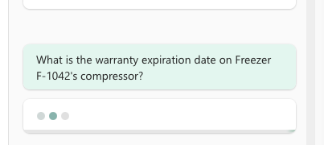
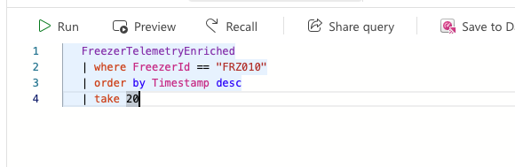
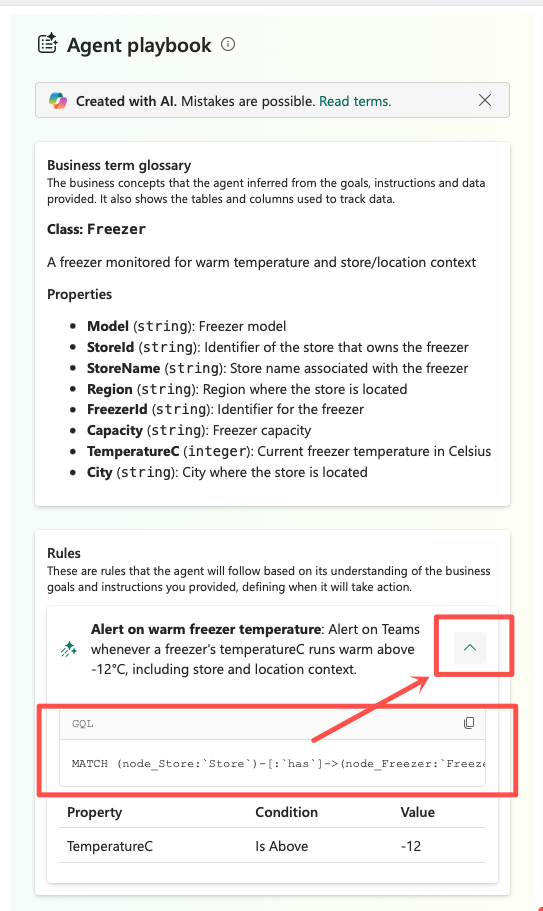

# Lab 13: Validate and Audit Agent Responses

**Duration:** 5 minutes as scheduled (down from 20 — this module's time was cut to fund Module 08's
expanded live setup, see `docs/agenda.md`). If Module 11/12 ran on time and there's spare room in the
schedule, run this hands-on as originally written; otherwise default to a facilitator-led walkthrough on
the instructor workspace per the note in `slides/module-13-slides.md`.
**Prerequisites:** Module 12 complete — `ColdChainDataAgent` and `ColdChainOperationsAgent` exist in the
"Fabric IQ" workspace, both grounded in `ColdChainOntology`, and the `Freezer running warm` Activator rule
has fired at least once.

**Learning objectives**
- Observe how a grounded agent handles a question outside its ontology, and contrast that with how an
  ungrounded LLM would likely respond.
- Trace one `Freezer running warm` alert backward through the entity instance, the triggering telemetry
  event, and the rule configuration that produced it.
- Be able to articulate what evidence a compliance or audit team would need to see to trust an agent's
  action.

> 🎤 Facilitator note: this lab is the section's designated time-box buffer. It's intentionally lighter on
> new construction than Modules 11–12 and heavier on inspection and discussion — every step below can be
> demonstrated on the projector as a group instead of run individually. See the fallback note at the end
> of this lab before you start if Module 11 or 12 ran long.

## Before you begin

Confirm your environment matches this state before starting:
- [ ] The "Fabric IQ" workspace contains `ColdChainDataAgent` and `ColdChainOperationsAgent`, both created
      in Module 12.
- [ ] `ColdChainOperationsAgent` is in a **Started**/**Running** state and its **History** (or
      **Activity**) view shows at least one activation of the `Freezer running warm` rule. If nothing has
      fired yet, wait a few minutes — the agent evaluates rules on a running interval — or ask a
      facilitator to point you at an instance that already fired.
- [ ] You know (or can quickly find) which `Freezer` entity instance and `Store` the fired alert refers
      to; you'll need it in Steps 3–5.

## Steps

1. **Open** the **ColdChainDataAgent** item in the "Fabric IQ" workspace and **open** its chat/test pane.

2. **Type** a deliberately out-of-scope question — one that names a property or entity `ColdChainOntology`
   never defined, for example: `What is the warranty expiration date on Freezer F-1042's compressor?` (no
   warranty property exists anywhere in the ontology) — and **send** it.

   

   > ✅ Expected result: the agent declines or hedges — it says it doesn't have that information, or
   > offers only the properties it *does* know about (`Model`, `Capacity`, `InstallDate`, `TemperatureC`,
   > `DoorOpen`). It should **not** confidently invent a plausible-sounding warranty date.

   <details>
   <summary>Troubleshooting</summary>

   If the agent *does* answer with a specific fabricated value instead of declining, that's a genuinely
   interesting (not embarrassing) teaching moment — it means the underlying model filled a gap the
   ontology didn't cover. Use it to reinforce the point from Module 13's theory: grounding narrows what an
   agent *can* correctly answer, but doesn't by itself guarantee every ungrounded question gets refused.
   Rephrase toward an in-scope question afterward so the room also sees the contrast.
   </details>

   > 🎤 Facilitator note: pause here and discuss as a group — does the response decline outright, hedge
   > ("I don't have that information, but here's what I do know about this freezer..."), or hallucinate?
   > What would "good" grounded behavior look like here, and did the agent meet that bar?

<!-- facilitator: this is the step most worth running live even in a compressed pass — it's short, and the room's reaction to whatever the agent actually says is the best teaching moment in the lab. -->

3. **Open** `ColdChainOperationsAgent`, **click** its **History** (or **Activity**) tab, and **find** the
   entry where the `Freezer running warm` rule fired. **Note** the specific `Freezer` instance (and its
   `Store`) named in that alert.

   > ✅ Expected result: the history entry names a specific `Freezer` entity instance, a timestamp, and the
   > `TemperatureC` value that satisfied the rule's condition — not a generic "something is wrong"
   > message.

4. **Open** `ColdChainOntology`'s graph view, **locate** that same `Freezer` entity instance, and
   **confirm** its current `TemperatureC` and `DoorOpen` property values, plus its `Store —has—> Freezer`
   relationship back to the store named in the alert.

   > ✅ Expected result: the entity instance in the graph shows property values consistent with the alert,
   > and its relationship path resolves back to a real `Store` (and, through it, a real `Customer`) — this
   > is the ontology link in the trace chain, not a raw table row.

5. **Go to** `ColdChainEventhouse`, **open** the KQL query editor against the database containing
   `FreezerTelemetryEnriched`, and **run** a query filtered to that `Freezer`'s identifier around the
   alert's timestamp, for example:

   ```kql
   FreezerTelemetryEnriched
   | where FreezerId == "<FreezerId from Step 3>"
   | order by Timestamp desc
   | take 20
   ```

   

   > ✅ Expected result: a row (or rows) appear whose `TemperatureC` value and timestamp match what
   > triggered the alert — this is the raw signal at the bottom of the trace chain, one query away from
   > the business-level alert you started with.

   <details>
   <summary>Troubleshooting</summary>

   No matching rows? Double-check the `FreezerId` matches exactly what's shown in the alert (Step 3) —
   copy-paste it rather than retyping. If the table genuinely has no data for that freezer around that
   time, the alert may have fired from a cached or stale evaluation; pick a different, more recent
   activation from the History tab and repeat from Step 3.
   </details>

6. **Return** to `ColdChainOperationsAgent`'s rule list, **open** the `Freezer running warm` rule, and
   **use** the **Copy code** (or equivalent "view query") option to inspect the actual condition it
   evaluates.

   

   > ✅ Expected result: the rule's condition is readable as a concrete query against the `TemperatureC`
   > property and a threshold — not a hidden setting you have to infer from behavior. Compare it against
   > what you just saw in Steps 4 and 5: does the threshold in the rule match what actually happened in
   > the data?

7. **Discuss** as a group (no new UI actions this step): if a compliance or audit team asked you to
   justify why this specific alert fired and why the action taken in response was appropriate, what would
   you show them? Use the four-step chain you just walked — alert → entity instance → triggering event →
   rule configuration — as the concrete answer.

   > ✅ Expected result: the room can articulate that every link in the chain is independently inspectable
   > (Steps 3–6 above), which is precisely what an ungrounded, free-form LLM answer cannot offer — there's
   > no equivalent chain to hand an auditor for a claim that was never tied to a specific entity, property,
   > or query in the first place.

   > 🎤 Facilitator note: this is a discussion step, not a click-through. If time is very short, this is
   > the step to compress hardest — a one-line callback to the trace you just built is enough.

## If time is short: accepted compression

Per [`docs/risk-fallback-plan.md`](../../docs/risk-fallback-plan.md), Module 13 is this section's
designated time-box buffer. If Module 11 or 12 ran long, it is an **explicitly accepted compression** to
skip individual hands-on repetition of Steps 2–6 and instead run them once, facilitator-led, on the
projector — attendees watch and discuss rather than each clicking through the same trace on their own
machine. Do not skip Step 2 (the ambiguous-question moment) or the discussion in Step 7 even under time
pressure — those two carry most of this module's learning objectives; the mechanical clicking in Steps
3–6 is what compresses safely.

<!-- facilitator: if you do compress to a single walkthrough, pick the alert instance ahead of time (during your pre-event dry run) so you're not hunting for a fired rule live in front of the room. -->

## Checkpoint

At the end of this lab, you should be able to:
- Describe what `ColdChainDataAgent` does when asked about something outside `ColdChainOntology`, and why
  that behavior is (or isn't) trustworthy.
- Name all four links in the trace chain for a `Freezer running warm` alert: the alert itself, the
  `Freezer` entity instance in `ColdChainOntology`, the triggering row in `FreezerTelemetryEnriched`, and
  the rule condition in `ColdChainOperationsAgent`.
- Explain, in one or two sentences, what makes this traceable chain fundamentally different from trusting
  a free-form LLM's claim about the same data.

Nothing new was created in your workspace this module — `ColdChainDataAgent`, `ColdChainOperationsAgent`,
`ColdChainOntology`, and the `Freezer running warm` rule are exactly what they were at the end of Module
04. Continue to [Module 14: Wrap-up and Resources](../module-14-wrapup/14-wrapup-and-resources.md).
