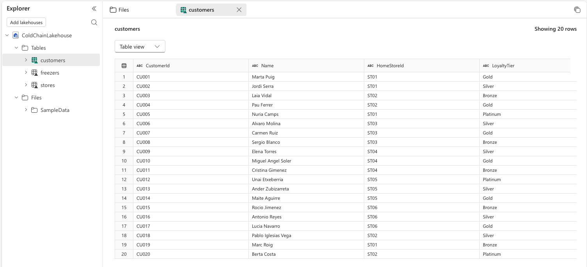
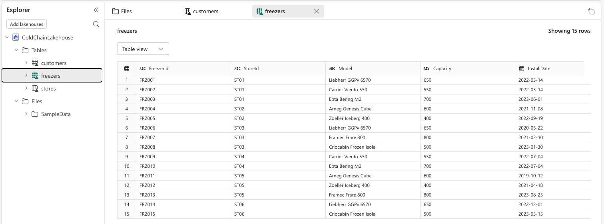
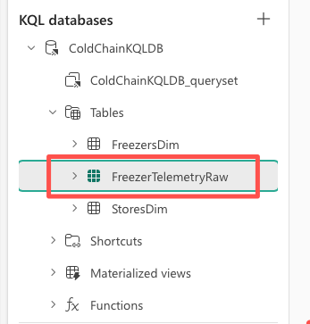

# Lab 01: Explore Workspace and Data Landscape

**Duration:** 15 minutes
**Prerequisites:** Module 00 complete — the "Fabric IQ" workspace is verified, `ColdChainLakehouse`
contains populated `Customers`/`Stores`/`Freezers` tables, and `ColdChainEventhouse`'s `ColdChainKQLDB`
contains an empty `FreezerTelemetryRaw` table.

**Learning objectives**
- Distinguish the two fundamentally different kinds of data already sitting in your workspace: static
  business reference data versus fast-moving raw event data.
- Directly observe why a raw telemetry row can't answer "is this freezer OK?" on its own.
- Understand what's still missing before that question becomes answerable — setting up Module 02.

This lab creates no new items — you're exploring what Module 00 already confirmed exists, looking at it
through a new lens: which of it is *business context* and which of it is *raw events*.

## Before you begin

Confirm your environment matches this state before starting:
- [ ] "Fabric IQ" workspace open, with `ColdChainLakehouse`, `ColdChainEventhouse`,
      `FreezerTelemetryEventstream`, and `00_LoadReferenceData` all present.
- [ ] `ColdChainLakehouse` tables `Customers`, `Stores`, `Freezers` contain rows of data.
- [ ] `ColdChainKQLDB`'s `FreezerTelemetryRaw` table exists (rows may still be zero — that's fine, it
      isn't needed for this lab).

## Steps

1. **Open** the **ColdChainLakehouse** item and **click** the **Customers** table in the Explorer pane.

   

   > ✅ Expected result: a small set of customer records — retail accounts that own one or more stores.
   > Note how few rows there likely are, and how unlikely they are to change during the workshop. This is
   > **static, slow-changing reference data**.

2. **Click** the **Stores** table, then the **Freezers** table, and **look** at the columns each one
   exposes — particularly any column on `Freezers` that references a store, and any column on `Stores`
   that references a customer.

   

   > ✅ Expected result: you can see the shape of a relationship chain sitting in these three tables —
   > roughly `Customer` owns `Store`, `Store` contains `Freezer` — even though nothing in the Lakehouse
   > yet formally declares that relationship. Keep this in mind; Module 03 is where we make it explicit.

3. **Go back** to the workspace item list and **open** **ColdChainEventhouse**, then **click** the
   **ColdChainKQLDB** database.

   

   > ✅ Expected result: the KQL query editor opens, with `FreezerTelemetryRaw` visible in the table list
   > under the database.

4. **Type** the following query and **click** **Run**:

   ```kql
   FreezerTelemetryRaw
   | take 20
   ```

   

   > ✅ Expected result: if Module 02's telemetry generator hasn't been started yet in your session, this
   > still returns zero rows — that's fine for this step, the point is the table's **schema**, not its
   > data. Look at the columns listed in the result grid header (or the table's schema view): you should
   > see something like `FreezerId`, `TemperatureC`, and `Timestamp`, and nothing else.

   <details>
   <summary>Troubleshooting</summary>

   If the table doesn't appear at all, revisit Module 00's Lab 00, Part B, Step 11–12 troubleshooting —
   this lab assumes that check already passed.
   </details>

5. **Compare** what you just saw in `FreezerTelemetryRaw`'s schema against the `Freezers` table's schema
   in the Lakehouse (go back and re-open it if you need to). **Notice** what's missing from the telemetry
   side: no store name, no customer, no target temperature, no indication of whether -9°C (or whatever
   value eventually streams in) is normal or a breach.

   > ✅ Expected result: you can articulate the gap out loud — `FreezerTelemetryRaw` has an ID and a
   > number, full stop. Every piece of business meaning needed to answer "is this freezer OK?" lives in
   > the Lakehouse tables you looked at in Steps 1–2, and right now nothing connects the two.

<!-- facilitator: this is the "cliffhanger" step — let the silence sit for a second after the comparison instead of immediately explaining the fix. Module 02 is the payoff. -->

> 🎤 Facilitator note: ask the room "so — is `FRZ-0142` at -9°C a problem?" and let a few people answer
> before pointing out that nobody can actually know yet from what's on screen. That's exactly the gap
> Module 02 starts closing.

## Checkpoint

At the end of this lab, your data landscape is unchanged from Module 00, but you should now be able to
describe it in these terms:

- `ColdChainLakehouse` (`Customers`, `Stores`, `Freezers`) — **static business reference data**: who owns
  what, slow-changing, full of the context needed to interpret events.
- `ColdChainEventhouse` / `ColdChainKQLDB` (`FreezerTelemetryRaw`) — **fast-moving event data**: an ID and
  a number, with no business context attached, and (once Module 02 starts the generator) new rows arriving
  continuously.
- No relationship yet connects the two, and no ontology, semantic grounding, or agent exists to bridge
  them — that gap is exactly what Module 02 starts to close.

Continue to [Module 02: Telemetry & Grounding](../module-02-telemetry-and-grounding/theory-02-telemetry-plus-semantic-context.md) (combining real-time telemetry with semantic context).
