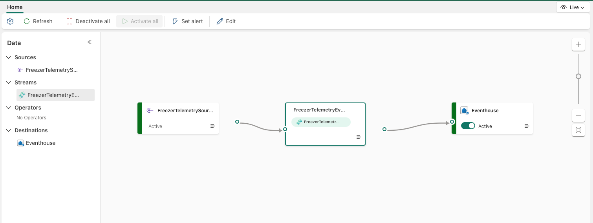
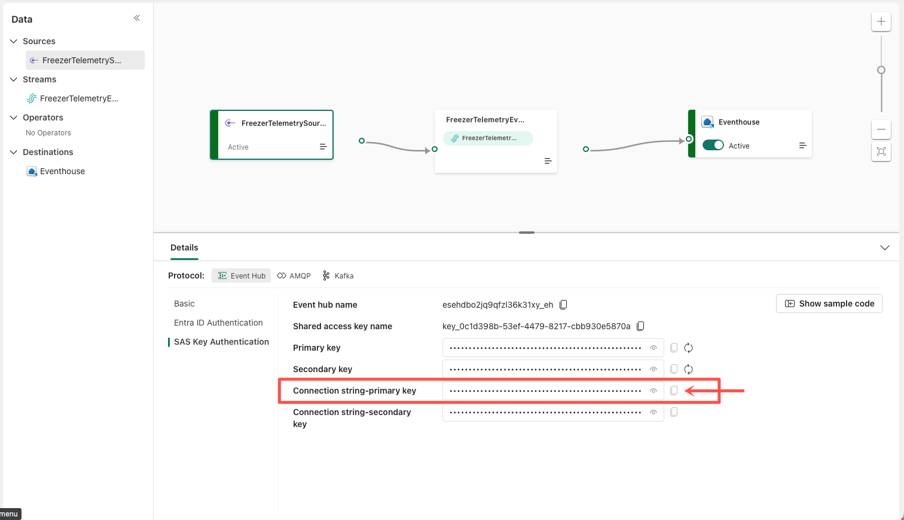
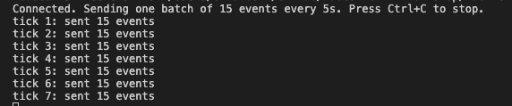
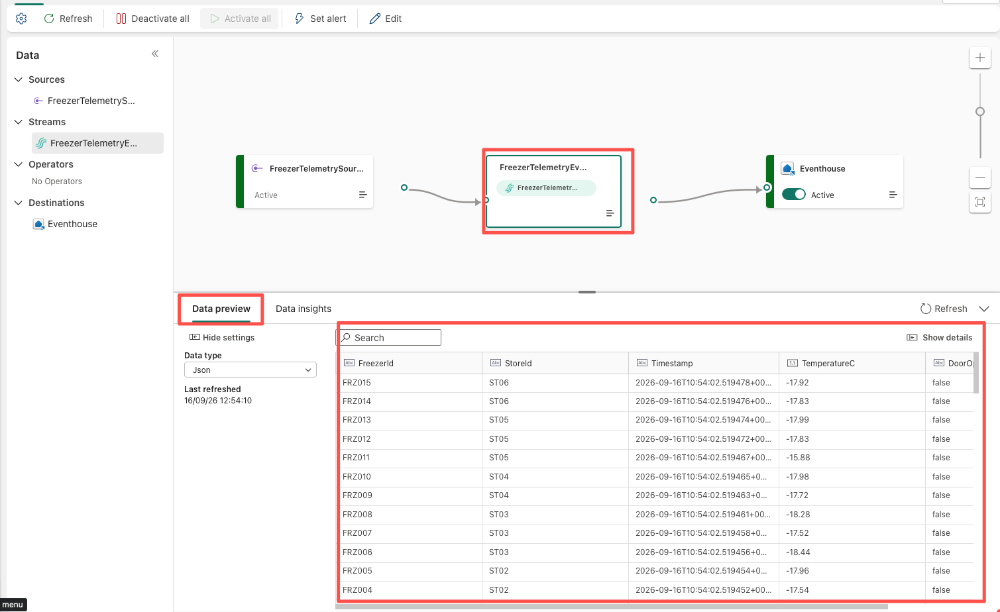
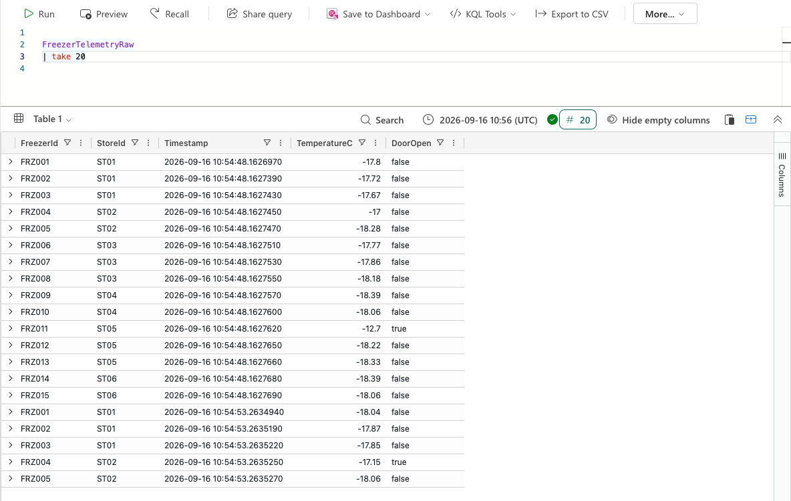
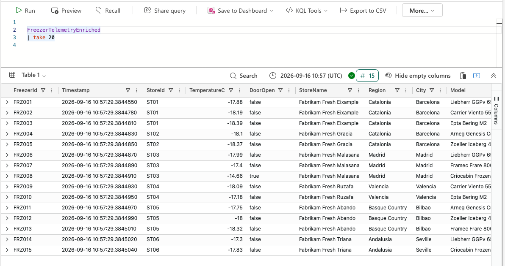

# Lab 02: Join Streaming and Reference Data

**Duration:** 25 minutes
**Prerequisites:** Module 01 complete. The `Fabric IQ` workspace exists and contains `ColdChainLakehouse`
(with populated `Customers`, `Stores`, `Freezers` tables), `ColdChainEventhouse` with KQL database
`ColdChainKQLDB` (whose full schema — `FreezerTelemetryRaw`, the seeded `StoresDim`/`FreezersDim`
dimension tables, and the `FreezerTelemetryEnriched` materialized view — was already applied by
`provision_fabric_iq.py` in Module 00; `FreezerTelemetryRaw` is empty until this lab's generator runs, and
`FreezerTelemetryEnriched` is empty until then too), and `FreezerTelemetryEventstream` (created but not yet
configured with a live source). You also need a terminal with Python 3.10+ available locally, and this repo
cloned so you can reach `artifacts/generator/freezer_telemetry_generator.py` and
`artifacts/Eventhouse/ColdChainKQLDB.kql`.

**Learning objectives**
- Retrieve an Eventstream custom endpoint's connection information from the Fabric portal and wire it into
  an external producer.
- Observe raw telemetry arriving in `FreezerTelemetryRaw` for the first time.
- Understand the `FreezerTelemetryEnriched` materialized view — already built for you by Module 00's
  provisioning script — and confirm it grounds raw readings with store and freezer context.

## Before you begin

Confirm your environment matches this state before starting:
- [ ] The `Fabric IQ` workspace is open and you can see `ColdChainLakehouse`, `ColdChainEventhouse`, and
      `FreezerTelemetryEventstream` in the item list.
- [ ] `ColdChainLakehouse` → `Freezers` and `Stores` tables contain rows (seeded in Module 00/01).
- [ ] Querying `FreezerTelemetryRaw | take 20` in `ColdChainKQLDB` returns **zero rows** — this is the
      "before" state this lab changes.
- [ ] `ColdChainKQLDB`'s Explorer pane already shows `FreezerTelemetryEnriched` under **Materialized
      views** — Module 00's provisioning script creates it up front; this lab explains it and confirms it
      works, rather than building it from scratch.
- [ ] You have a terminal open at the root of this cloned repo, with `python3 --version` (**macOS/Linux**)
      or `python --version` (**Windows**) reporting 3.10 or later.

## Steps

### Part A — Get the Eventstream's connection information

1. **Click** the `FreezerTelemetryEventstream` item in the `Fabric IQ` workspace item list to open it.

   

2. **Click** the custom endpoint source node on the authoring canvas (the tile representing the source
   your generator will publish into).

   > ✅ Expected result: a **Details** pane opens on the right showing **Basic**, **SAS Key
   > Authentication**, and protocol tabs (**Event Hub** / **AMQP** / **Kafka**).

3. **Click** the **Event Hub** protocol tab, then **click** **SAS Key Authentication**.

   

4. **Copy** the value shown under **Connection string-primary key** (it looks like
   `Endpoint=sb://eventstream-xxxxxxxx.servicebus.windows.net/;SharedAccessKeyName=key_xxxxxxxx;SharedAccessKey=xxxxxxxx;EntityPath=es_xxxxxxxx`).

   <details>
   <summary>Troubleshooting</summary>

   If the **Details** pane doesn't show a connection string, the eventstream may not be published yet.
   **Click** **Publish** on the ribbon first, then reselect the custom endpoint node.
   </details>

   *Adapted from: [Add a custom endpoint or custom app source to an eventstream — "Get custom endpoint
   connection details and sample
   code"](https://learn.microsoft.com/fabric/real-time-intelligence/event-streams/add-source-custom-app#get-custom-endpoint-connection-details-and-sample-code)*

<!-- facilitator: this connection string is the single most copy-paste-error-prone step in the whole
module — watch for trailing spaces or partial copies when circulating. -->

### Part B — Paste the connection string into the generator config

5. **Open** `artifacts/generator/freezer_telemetry_generator.py` in a text editor or your IDE.

6. **Find** the marked configuration line near the top of the file (commented as the Eventstream
   connection string placeholder) and **paste** the value you copied in step 4, replacing the placeholder
   text between the quotes.

   > ✅ Expected result: the config line now contains your real `Endpoint=sb://...` string instead of a
   > placeholder like `"PASTE_EVENTSTREAM_CONNECTION_STRING_HERE"`.

7. **Save** the file.

   <details>
   <summary>Troubleshooting</summary>

   If you accidentally copied the **Connection string-secondary key** instead of the primary key, that's
   fine too — either key authenticates. Just make sure you copied a full connection string, including the
   `EntityPath=` segment at the end; a truncated string is the most common cause of silent send failures
   later in this lab.
   </details>

   *Adapted from: [BUILD_PLAN.md](../../BUILD_PLAN.md) provisioning design — the connection string is
   only obtainable from the portal after the Eventstream item exists, so this manual paste step
   deliberately isn't scripted.*

### Part C — Run the generator and confirm events are flowing

8. **Open** a terminal at the root of the cloned repo, **activate** the virtual environment from Module
   00's Part A, and **install** the one extra dependency this script needs (Fabric's custom-endpoint
   source speaks the Event Hubs/AMQP protocol, not plain HTTPS — see the comment block at the top of the
   script for why):

   **macOS/Linux:**
   ```bash
   source .venv/bin/activate
   pip install azure-eventhub
   ```

   **Windows (PowerShell):**
   ```powershell
   .venv\Scripts\Activate.ps1
   pip install azure-eventhub
   ```

   > ✅ Expected result: `azure-eventhub` installs without errors. If you already ran
   > `check_environment.py --install-deps` in Module 00's Part A, this is already done — just activate
   > the venv and skip ahead. (Installing outside the venv may fail with
   > `externally-managed-environment` — see `setup/README.md` if that happens.)

9. **Run** the generator:

   **macOS/Linux:**
   ```bash
   python3 artifacts/generator/freezer_telemetry_generator.py
   ```

   **Windows (PowerShell):**
   ```powershell
   python artifacts/generator/freezer_telemetry_generator.py
   ```

   

   > ✅ Expected result: the console prints a running log of freezer readings being sent (one line per
   > event, per freezer, on a short interval).

10. **Switch** back to `FreezerTelemetryEventstream` in the Fabric portal and **click** **Live view** (or
    **refresh** it if you're already there).

11. **Click** the FreezerTelemetryEventstream node and **check** the **Data preview** tab.

    > ✅ Expected result: the data preview shows a live stream of JSON events with `FreezerId`, `StoreId`,
    > `Timestamp`, `TemperatureC`, and `DoorOpen` fields, refreshing every few seconds.

    

    <details>
    <summary>Troubleshooting — no events showing up</summary>

    Work through these in order:
    1. **Check the connection string was pasted correctly** — reopen
       `artifacts/generator/freezer_telemetry_generator.py` and confirm there's no leftover placeholder
       text, stray quote, or truncated `EntityPath=` segment.
    2. **Check the generator process is still running** — look at the terminal from step 9; if it exited
       or shows an authentication/connection error, fix the connection string and rerun it.
    3. **Check the Eventstream's data preview for ingestion errors** — in Live view, look for an error
       badge on the source or destination node; click it to see the specific ingestion failure message.

    If all three check out and you still see nothing after a couple of minutes, confirm your machine's
    network/VPN isn't blocking outbound traffic to `*.servicebus.windows.net` (the same class of issue
    called out for `fab auth login` in `prerequisites/PREREQUISITES.md`).
    </details>

    *Adapted from: [Digital twin builder RTI tutorial part 2: Get and process streaming data — "Add
    source"](https://learn.microsoft.com/fabric/real-time-intelligence/digital-twin-builder/tutorial-rti-2-get-streaming-data)*

> 🎤 Facilitator note: leave the generator terminal visible on the projector here — watching the console
> log tick over alongside the portal's live view is the moment this module's whole point ("the table
> Module 01 left empty is now filling up") becomes visible.

### Part D — Confirm raw telemetry is arriving

12. **Click** `ColdChainKQLDB` in the workspace item list, then **click** the KQL Queryset associated with
    it (or **click** **New query set** if none is open yet).

13. **Type** `FreezerTelemetryRaw | take 20` in the query pane and **click** **Run**.

    

    > ✅ Expected result: 20 rows return, each with a populated `TemperatureC` and `DoorOpen` value —
    > contrast this with Module 01's lab, where this same query returned zero rows because nothing had
    > been published into the eventstream yet.

    *Adapted from: [Digital twin builder RTI tutorial part 2 — "Create an eventhouse" /
    verifying `bus_data_raw`](https://learn.microsoft.com/fabric/real-time-intelligence/digital-twin-builder/tutorial-rti-2-get-streaming-data)*

### Part E — Understand the enriched, grounded view

`FreezerTelemetryEnriched` already exists — `provision_fabric_iq.py` created it, along with the rest of
`ColdChainKQLDB`'s schema, back in Module 00 (see `run_kql_schema()` in that script, and
`artifacts/Eventhouse/HOW-TO-EXPORT.md` for why this runs automatically rather than as a manual step).
This part is about reading and understanding the KQL that defines it, not creating it from scratch —
Module 03 is where this workshop's hands-on KQL/ontology authoring time is spent.

14. **Open** [`artifacts/Eventhouse/ColdChainKQLDB.kql`](../../artifacts/Eventhouse/ColdChainKQLDB.kql) in
    a text editor and **find** the `.create-or-alter materialized-view` block near the bottom (section 3,
    "ENRICHED MATERIALIZED VIEW").

15. **Read** through it alongside this summary of what each piece does:
    - `lookup kind=leftouter StoresDim on StoreId` — brings in `StoreName`/`Region`/`City` for the store
      each freezer belongs to.
    - `lookup kind=leftouter (FreezersDim | project FreezerId, Model, Capacity) on FreezerId` — brings in
      `Model`/`Capacity`, dropping `FreezersDim`'s own `StoreId` first so it doesn't collide with the one
      already on the fact table.
    - `summarize arg_max(Timestamp, *) by FreezerId` — collapses the stream down to exactly one row per
      freezer: whichever reading has the latest `Timestamp`, across every column.

16. **In the portal**, in the `ColdChainKQLDB` KQL Queryset, **confirm** `FreezerTelemetryEnriched` is
    listed under **Materialized views** in the Explorer pane, then **run**:
    ```kql
    .show materialized-view FreezerTelemetryEnriched
    ```

    > ✅ Expected result: the command returns one row describing the view — confirming it's real and
    > already active, not just present in the script you read above.

    <details>
    <summary>Troubleshooting</summary>

    If `FreezerTelemetryEnriched` isn't listed, or `.show materialized-view` errors "not found", Module
    00's `provision_fabric_iq.py` run either skipped the KQL schema step (`--skip-kql-schema`) or it
    failed — check that run's summary output. You can re-run it now, from the repo root, in your activated
    venv:

    **macOS/Linux:**
    ```bash
    python3 setup/provision_fabric_iq.py --force
    ```

    **Windows (PowerShell):**
    ```powershell
    python setup\provision_fabric_iq.py --force
    ```

    Or paste `ColdChainKQLDB.kql`'s contents into a new Queryset tab and run it manually — every statement
    in it is safe to re-run.
    </details>

    *Adapted from: this lab's own [`ColdChainKQLDB.kql`](../../artifacts/Eventhouse/ColdChainKQLDB.kql),
    following the conceptual pattern in [Materialized views use
    cases](https://learn.microsoft.com/kusto/management/materialized-views/materialized-view-use-cases)
    and [Update policy](https://learn.microsoft.com/kusto/management/update-policy) — see
    `theory-02-telemetry-plus-semantic-context.md` for why this lab uses a materialized view rather than
    an update policy.*

### Part F — Confirm telemetry is now grounded

17. **Type** `FreezerTelemetryEnriched | take 20` in a new query tab and **click** **Run**.

    

    > ✅ Expected result: 20 rows return, each carrying the live `TemperatureC` and `DoorOpen` values from
    > `FreezerTelemetryRaw` **alongside** `StoreName`, `Region`, `Model`, and `Capacity` columns pulled
    > from the `Stores` and `Freezers` reference data. This is the moment a bare number becomes a
    > groundable business fact — e.g. "Contoso Downtown Store, `Model: BlastFreeze-9000`, reading
    > -9.0°C" instead of just "F-1042, -9.0."

### Part G — Let the generator run

18. **Leave** the generator process from step 9 running in its terminal for a couple of minutes while you
    continue reading.

19. **Re-run** `FreezerTelemetryEnriched | take 20` once or twice more over that time.

    > ✅ Expected result: the `Timestamp` values advance and `TemperatureC` readings change between runs —
    > confirming the view stays current as new telemetry arrives, rather than being a one-time snapshot.

    <!-- facilitator: don't stop the generator at the end of this lab — Module 03's ontology work and
    Module 04's agent demos both expect it still running. The generator's built-in anomaly injection
    (occasional out-of-range readings) isn't the focus yet — flag it in passing and tell attendees it
    becomes relevant once agents start reasoning over these readings in a later module. -->

## Checkpoint

At the end of this lab, your workspace should contain:
- `FreezerTelemetryEventstream` actively receiving events from the running generator process, wired to a
  real connection string pasted from the portal.
- `FreezerTelemetryRaw` populated with live, continuously arriving rows.
- `FreezerTelemetryEnriched` — a materialized view built with `arg_max(Timestamp, *)` per `FreezerId` —
  populated and updating, with every row grounded in `StoreName`, `Region`, `Model`, and `Capacity` from
  the Lakehouse-sourced reference data.
- The generator still running in the background, ready for later modules.

Raw telemetry is no longer just numbers — it now carries the enterprise context needed to say whether a
reading is fine or a crisis. Continue to [Module 03: Ontology
Design](../module-03-ontology-design/lab-03-build-retail-coldchain-ontology.md).
