# Lab 04: Build a Data Agent and Operations Agent

**Duration:** 20 minutes
**Prerequisites:** Module 03 is complete. `ColdChainOntology` exists in the **Fabric IQ** workspace, with
entity types `Customer`, `Store`, and `Freezer` bound to real data, and relationships
`Store`—has—>`Freezer` and `Customer`—shops at—>`Store` defined. The Module 02 synthetic freezer telemetry
generator must still be running and streaming into `ColdChainEventhouse`.

**Learning objectives**
- Create `ColdChainDataAgent`, a Fabric Data Agent grounded in `ColdChainOntology`, and query it with
  natural-language questions.
- Create `ColdChainOperationsAgent`, a Fabric Operations Agent grounded in `ColdChainOntology` and
  configured to monitor the `Freezer` entity type.
- Create an Activator Ontology Rule named `Freezer running warm` that turns a raw temperature threshold
  into a business-language alert.
- Confirm the rule fires when the Module 02 generator's periodic synthetic anomaly lands.

## Before you begin

Confirm your environment matches this state before starting:
- [ ] The **Fabric IQ** workspace contains a `ColdChainOntology` item (built in Module 03).
- [ ] `ColdChainOntology` has all three entity types — `Customer`, `Store`, `Freezer` — each bound to data,
      not just defined with no binding.
- [ ] Both relationships exist: `Store`—has—>`Freezer` and `Customer`—shops at—>`Store`.
- [ ] `Freezer` carries the static properties `Model`, `Capacity`, `InstallDate` and the live properties
      `TemperatureC`, `DoorOpen`.
- [ ] The Module 02 telemetry generator (`generator/freezer_telemetry_generator.py`) is still running in a
      terminal somewhere and is actively streaming into `ColdChainEventhouse` — if you closed that terminal
      after Module 02, restart it now using the same steps from Module 02's lab. Nothing in this lab works
      without live data flowing.
- [ ] You have a Microsoft Teams account, and your tenant admin has enabled the Operations Agent, Copilot,
      and Azure OpenAI tenant settings called out in
      [`prerequisites/PREREQUISITES.md`](../../prerequisites/PREREQUISITES.md).

## Steps

### Create the Data Agent

1. In the **Fabric IQ** workspace, **click** the **+ New item** button, then search for and **select**
   **Data agent**. **Type** `ColdChainDataAgent` in the Name field, then **click** **Create**.

   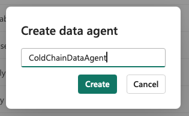

   

   
Troubleshooting

   If **Data agent** doesn't appear as an item type, the tenant setting enabling it may not be turned on —
   see [`prerequisites/PREREQUISITES.md`](../../prerequisites/PREREQUISITES.md).
   

   > ✅ Expected result: the agent authoring canvas opens once the item finishes provisioning.

2. **Select** **Add a data source**, **search** for `ColdChainOntology`, **select** it, then **click**
   **Add**.

   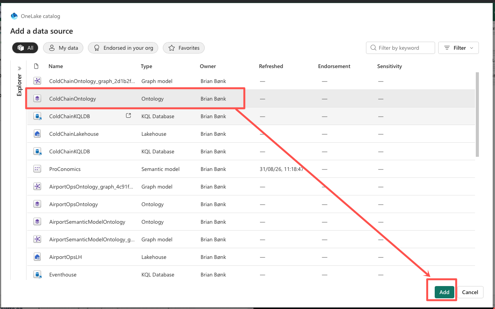

   > ✅ Expected result: `ColdChainOntology` now appears as a source in the Explorer pane, with `Customer`,
   > `Store`, and `Freezer` listed as its entity types.

3. **Select** **Agent instructions** from the ribbon, and at the bottom of the input box **type**
   `Support group by in GQL`. **Close** the Agent instructions tab once the instruction is applied.

   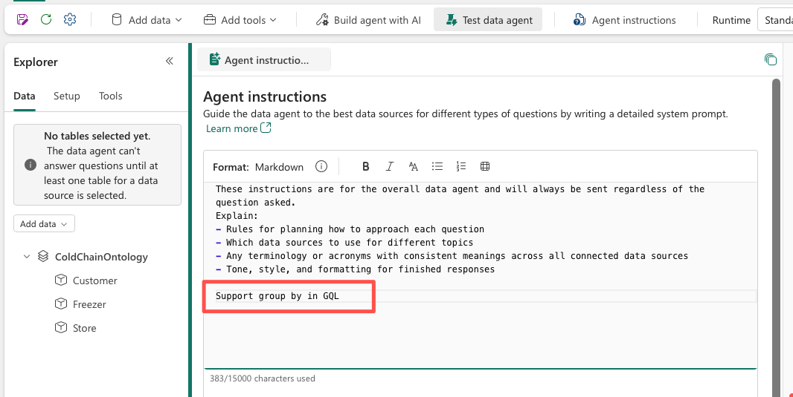

   > ✅ Expected result: the instruction is saved automatically — this works around a known aggregation
   > issue and improves answers to questions that group or count across the ontology.

### Test the Data Agent with natural-language questions

4. In the agent's chat box, **type** the question `Which freezers belong to Fabrikam Fresh Eixample?` and
   **press Enter**.

   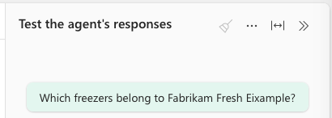

   > ✅ Expected result: the agent returns the three freezers scoped to the Eixample store (`FRZ001`,
   > `FRZ002`, `FRZ003`). The answer is
   > only possible because the agent walked the `Store`—has—>`Freezer` relationship defined in the
   > ontology — you never told it which table joins on which key, and it never surfaces one.

5. **Type** the question `List customers who shop at stores with a freezer running warmer than -12°C.`

   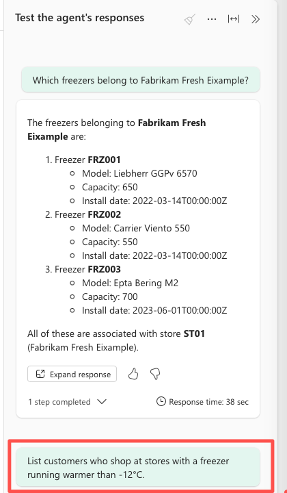

   

   
Troubleshooting

   If the agent replies that there's no data, wait a few minutes for it to finish initializing against the
   ontology and try again — this is a known first-run delay, not a failure.
   

   > ✅ Expected result: the agent returns a list of customer names, having chained **two** relationships
   > (`Customer`—shops at—>`Store` and `Store`—has—>`Freezer`) plus a property filter on
   > `Freezer.TemperatureC` — entirely through entity and relationship names. This is the payoff of
   > ontology grounding: a question spanning three entity types and two relationships needs zero manual
   > joins from you.

6. **Type** a third question of your own, for example
   `For each store, list its freezers and their current temperature.`

   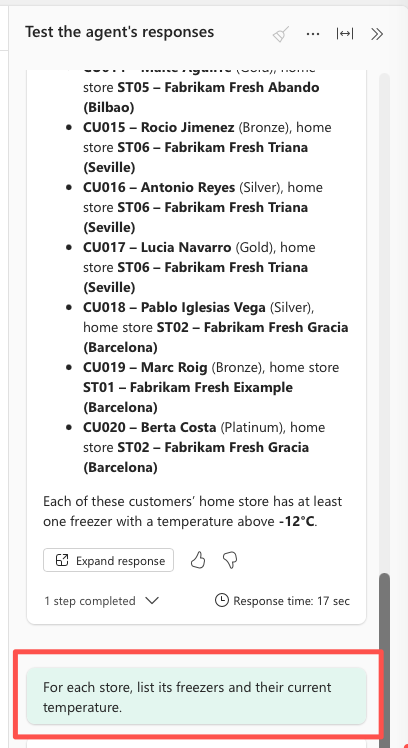

   > ✅ Expected result: the response groups freezers by store and references `Store` and `Freezer` by
   > name — notice the response text itself never mentions a table or column name.

<!-- facilitator: if attendees ask why the agent sometimes phrases an answer slightly differently between
runs, that's expected LLM-backed variance in phrasing — the grounding (which entities/relationships it
used) is what should stay consistent, not the exact wording. -->

### Create the Operations Agent

7. **Return** to the **Fabric IQ** workspace item list, **click** **+ New item**, then search for and
   **select** **Operations agent**. **Type** `ColdChainOperationsAgent` in the Name field, confirm the
   workspace is **Fabric IQ**, and **click** **Create**.

   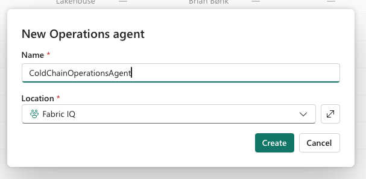

   > ✅ Expected result: the **Agent setup** page opens for `ColdChainOperationsAgent`.

8. On the **Agent setup** page, in the **Agent instructions** box, **type**
   `Monitor Freezer entities for temperature running warm (above -12 degrees) and notify me on Teams when one is found.` Under
   **Knowledge**, **select** **Add data**, **search** for `ColdChainOntology`, and **select** it.

   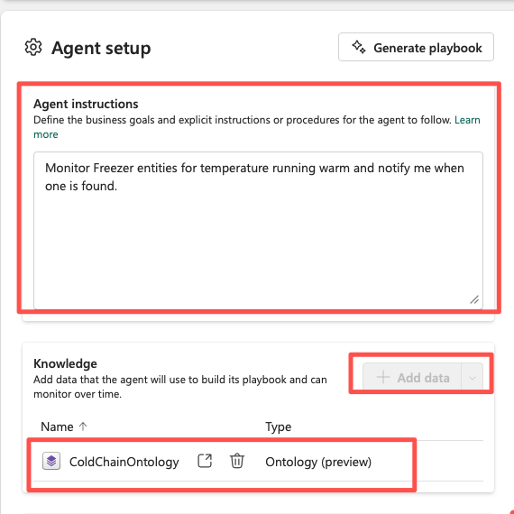

   

   
Troubleshooting

   If `ColdChainOntology` doesn't appear in the Add data search, confirm you have at least read access to
   the ontology item and that it finished any pending data-binding refresh from Module 03.
   

   > ✅ Expected result: `ColdChainOntology` is listed as the agent's knowledge source, with `Freezer`
   > visible as a monitorable entity type alongside `Customer` and `Store`.

9. **Click** **Save**, then **select** **Generate playbook**. **Review** the playbook and **confirm** it
   references the `Freezer` entity type and its `TemperatureC` property by name.

   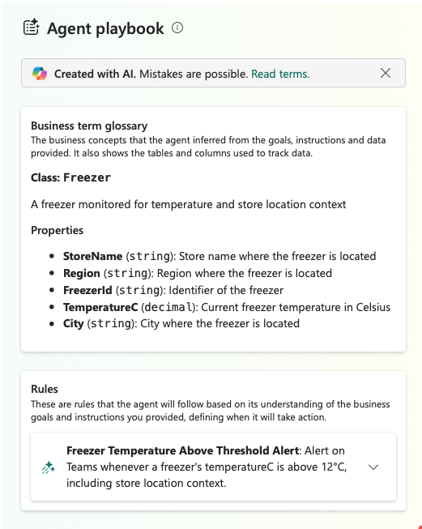

   

   
Troubleshooting

   If the generated playbook references raw column names instead of `Freezer`/`TemperatureC`, or is empty,
   go back to Module 03 and confirm the `Freezer` entity type's data binding actually completed — an
   unbound entity type produces a playbook with nothing to monitor.
   

   > ✅ Expected result: the playbook lists a goal and a rule referencing the `Freezer` entity type and
   > `TemperatureC` property — not the underlying `FreezerTelemetryRaw` KQL table or column.

10. **Select** **Save** and then **Start** in the toolbar to start the agent.

    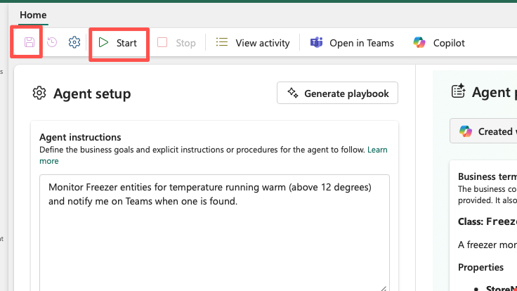

    > ✅ Expected result: the agent's status changes to **Running**. By default it can message you in
    > Teams whenever it detects a matching condition — install the **Fabric Operations Agent** Teams app
    > now if you haven't already, so you can actually receive that message later in this lab.

### Create the Activator Ontology Rule: `Freezer running warm`

11. **Open** `ColdChainOntology`. **Select** the **...** menu next to the `Freezer` entity type (either
    from the Home configuration canvas, or from the entity type's detail view), **hover** over
    **Manage rules**, and **select** **Add rule**. **Type** `Freezer running warm` as the rule name.

    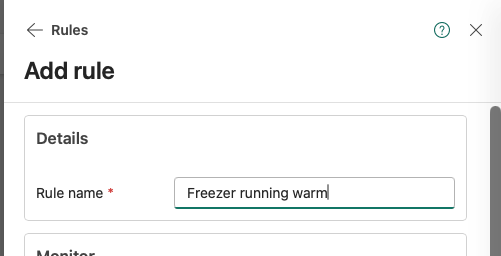

    > ✅ Expected result: the **Add rule** panel opens, showing **Details**, **Monitor**, **Conditions**,
    > **Actions**, and **Save location** sections.

12. Under **Monitor**, **select** the `Freezer` entity type's `TemperatureC` property. Under
    **Conditions**, **configure** an **Is greater than** condition with a threshold of `-12` (°C), and **set** the
    temporal window so the condition must hold for a **sustained period — at least 5 minutes** — before it
    counts as met, rather than firing on a single reading.

    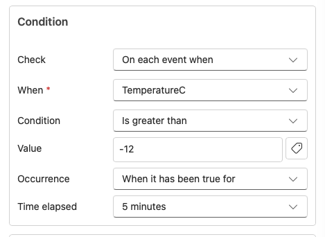

    

    
Troubleshooting

    If you only see a stateless, single-event condition option with no duration/window setting, look for an
    aggregation or "over the last N minutes" control in the Conditions step — ontology-authored rules
    support these temporal conditions via the same configuration Fabric Activator itself uses. If it's
    genuinely unavailable in your tenant's current preview build, fall back to a plain **Is above -12**
    condition for the lab and note the false-positive risk from a momentary door-open blip.
    

    > ✅ Expected result: the condition reads roughly as "`TemperatureC` is above -12°C, sustained for at
    > least 5 minutes" — this is what keeps a normal few-second door-open from triggering a false alert,
    > while still catching the sustained anomaly (door left open, or compressor fault) the Module 02
    > generator periodically simulates.

13. Under **Actions**, **choose** either **Message to individuals** or **Email** — whichever
    your tenant supports and you have installed/enabled. **Confirm** the action's message template
    references the freezer and its store by name rather than a bare identifier.

    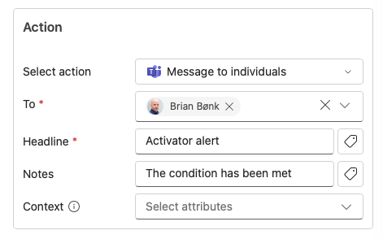

    > ✅ Expected result: an action is attached to the rule. Both Teams and email are valid choices here —
    > pick whichever notification channel is actually set up for your tenant/account; the rule's behavior
    > is otherwise identical either way.

14. Under **Save location**, **leave** the default (a new Fabric Activator item) selected unless your
    facilitator asks you to reuse an existing one, then **select** **Create**. Back in the **Rules** panel,
    **confirm** the toggle next to `Freezer running warm` is switched **on**.

    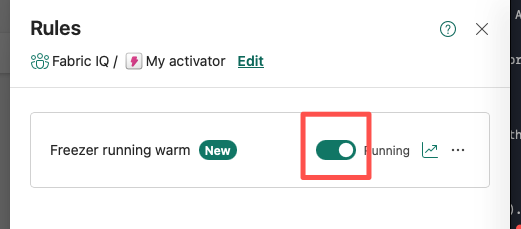

    > ✅ Expected result: `Freezer running warm` appears in the Rules panel, enabled, and — per Microsoft's
    > guidance — is backed by a new Fabric Activator item in your workspace that you could open directly
    > for deeper editing if needed.

### Wait for the alert and confirm it fires

15. **Wait** for the Module 02 telemetry generator's next periodic anomaly injection. While you wait,
    **optionally ask** `ColdChainDataAgent` the question `Which freezers are currently running warm?` to
    watch the live property value change from the Data Agent side.

    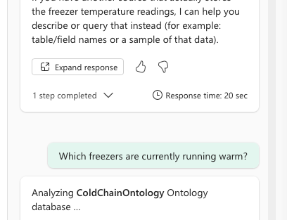

    > ✅ Expected result: within a few minutes of the generator injecting the sustained anomaly, you
    > receive a Teams message or email from `ColdChainOperationsAgent` (or from the `Freezer running warm`
    > Activator rule directly). The message body names the **specific freezer and its store** (for
    > example, "Freezer FRZ001 at Fabrikam Fresh Eixample is running warm") — not a bare device ID and a raw
    > number. That business-language framing is the entire point of authoring the rule against the
    > ontology instead of a raw KQL threshold.

    

    
Troubleshooting

    If no alert arrives after several minutes:
    - **Check the generator is still running and actually injecting anomalies.** Go back to
      [Module 02's lab](../module-02-telemetry-and-grounding/) and confirm the generator process is alive
      and that its console output shows it periodically pushing an out-of-range `TemperatureC` reading, not
      just steady-state values. If the generator was stopped or crashed, restart it using Module 02's
      steps — nothing downstream can fire without live anomalous data actually landing in
      `ColdChainEventhouse`.
    - **Check the rule's condition and threshold.** Reopen `Freezer running warm` from the **Rules** panel
      (or **Open in Activator** for the underlying item) and confirm the threshold is `-12`, the condition
      direction is "above," and the sustained-duration window isn't set so long that the anomaly window
      hasn't elapsed yet. A window set far longer than the generator's actual anomaly duration will never
      fire.
    - **Check notification delivery, not just the rule.** If the rule's evaluation history (visible from
      the underlying Activator item) shows it activated but you received nothing, confirm the Teams app is
      installed and you're checking the right account, or that the email address configured on the action
      is correct.
    - Still stuck? Pair with a neighbor whose rule fired successfully, or flag a facilitator — see
      [`docs/risk-fallback-plan.md`](../../docs/risk-fallback-plan.md) for the Module 04 fallback
      screenshot sequence if the live preview path is misbehaving for the whole room.
    

<!-- facilitator: this step is the one most likely to run long, since it depends on the generator's timer,
not on attendee action. If the room is close to time and the alert hasn't landed for most people yet, show
your own already-fired alert (from the 72-hour dry run) on the shared screen and move on — don't let this
single wait eat into Module 05's buffer. -->

> 🎤 Facilitator note: if several attendees are waiting at once, use the gap to reinforce the theory
> point about temporal conditions — ask the room what would happen if the rule had no sustained-duration
> window (answer: it would also fire on an ordinary door-open-and-close).

## Checkpoint

At the end of this lab, your "Fabric IQ" workspace should contain, in addition to everything from Module
03:
- `ColdChainDataAgent` — a Fabric Data Agent grounded in `ColdChainOntology`, tested with natural-language
  questions that resolve through entity and relationship names.
- `ColdChainOperationsAgent` — a Fabric Operations Agent grounded in `ColdChainOntology`, configured to
  monitor the `Freezer` entity type, and started.
- `Freezer running warm` — an Activator Ontology Rule on `Freezer.TemperatureC`, backed by a Fabric
  Activator item, wired to a Teams or email action, and confirmed to fire in business language when the
  Module 02 generator's synthetic anomaly lands.

Continue to [Module 05: Prompting, Trust & Traceability](../module-05-prompting-trust-traceability/lab-05-validate-and-audit-agent-responses.md).
